# ゲームショッピングサイト (GameShop)

Vue 3 製のゲーム EC サイトデモアプリです。ショッピングカート・会員管理・購入履歴などの基本的な EC 機能を備えています。

**デモ:** https://sadaakiemuravaltes.github.io/shopping/

---

## 画面別機能解説

### TOP ページ（商品一覧）

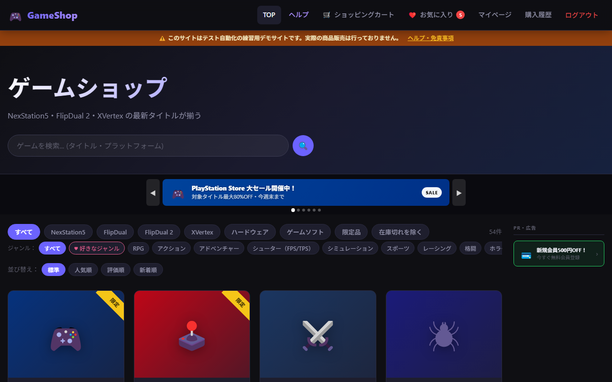

商品一覧を表示するメインページです。

- **カルーセルバナー** — 6枚のバナーが3秒ごとに自動スライド（左右矢印・ドットナビ付き）
- **プラットフォーム/カテゴリフィルター** — NexStation5・FlipDual・ハードウェア・限定品・在庫切れを除くなど複数同時選択可
- **ジャンルフィルター** — RPG・アクションなど14ジャンルで絞り込み
- **好きなジャンルボタン** — ログインユーザーが設定したジャンルをワンクリックで適用
- **並び替え** — デフォルト・人気順・評価順・新着順
- **キーワード検索** — タイトル・プラットフォームで絞り込み
- **広告サイドバー** — 画面右に1件ランダム表示（1100px 以上の幅のみ）
- **無限スクロール** — 12件ずつ追加読み込み

---

### 商品フィルター適用時

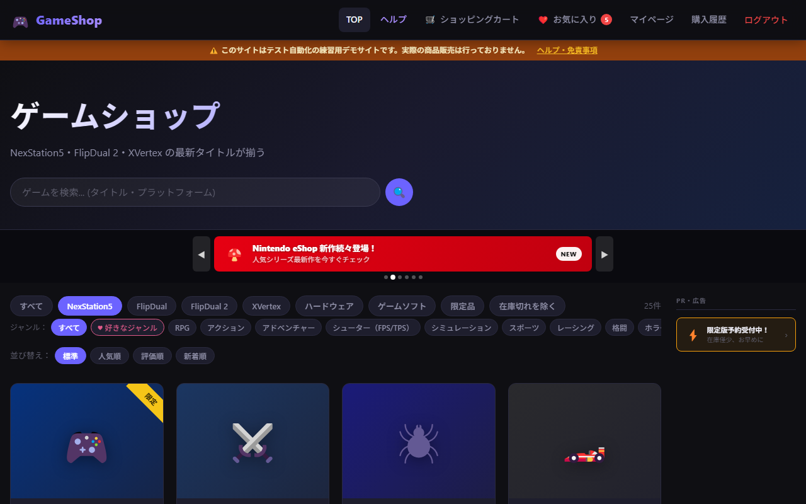

プラットフォームボタンをクリックすると対象商品に絞り込まれます。複数のフィルターを同時に選択することもできます。

---

### 商品詳細ページ

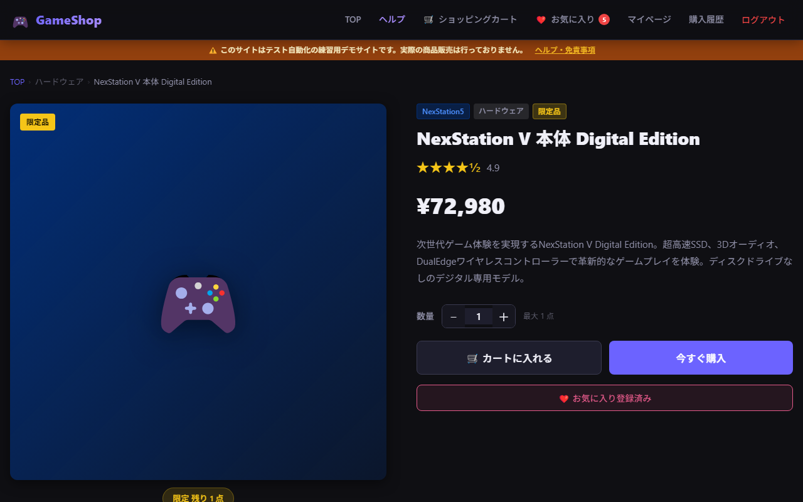

- **商品情報** — 絵文字サムネイル・プラットフォーム/カテゴリタグ・限定バッジ・在庫状況
- **評価** — 星評価（0.5刻み）と数値
- **数量セレクター** — 在庫数に応じた上限で ─/＋ ボタン調整
- **アクションボタン** — 「カートに入れる」「今すぐ購入」
- **お気に入りボタン** — ハートアイコンでブックマーク登録/解除
- **パンくずリスト** — TOP > カテゴリ > 商品名
- **レビュー欄** — 購入者レビューをページ下部の iframe で表示

---

### ショッピングカート

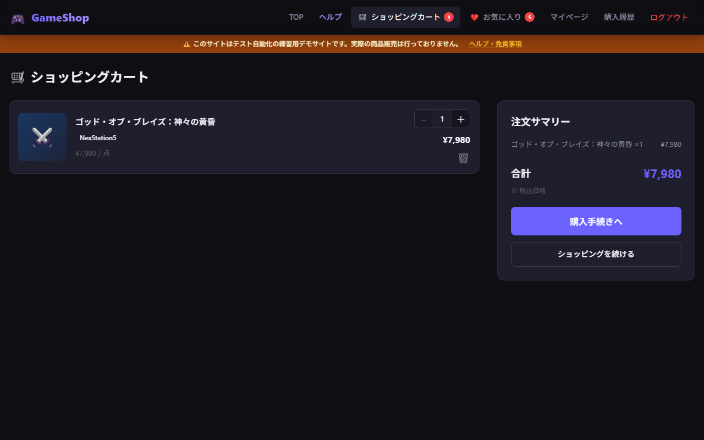

- **商品一覧** — 絵文字サムネイル・商品名・単価・数量（−/＋で変更）・ゴミ箱アイコンで削除
- **注文サマリー** — 右サイドバーに商品小計と合計金額をリアルタイム表示
- **「購入手続きへ」ボタン** — ログイン済みのみ進行可（未ログインはログイン画面へ）

---

### チェックアウト（配送先入力）

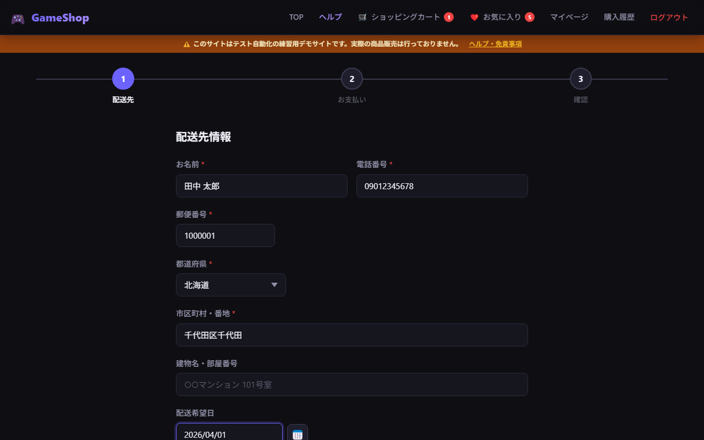

3ステップのウィザード形式（① 配送先 → ② お支払い → ③ 確認）。

**ステップ1: 配送先情報**
- お名前・電話番号・郵便番号（7桁入力で zipcloud API による住所自動補完）
- 都道府県セレクター（47都道府県）
- 市区町村・番地・建物名
- **配送希望日** — テキスト入力（yyyy/mm/dd）またはカレンダーアイコンで選択（翌日〜1ヶ月先）
- **配送希望時間帯** — 午前・14-16時など6スロットから選択

---

### チェックアウト（お支払い）

チェックアウト ステップ2のお支払い方法選択画面です。

- **クレジットカード** — カード番号入力で Visa・Mastercard・AMEX・JCB・Discover を自動判定・色分け表示。カード番号は4桁ごとにスペース自動挿入
- **コンビニ払い / 銀行振込** — 選択のみ（デモのため決済処理なし）
- **カード限度額チェック** — 注文金額がカード限度額を超える場合、確認ステップでエラー表示

---

### 注文完了

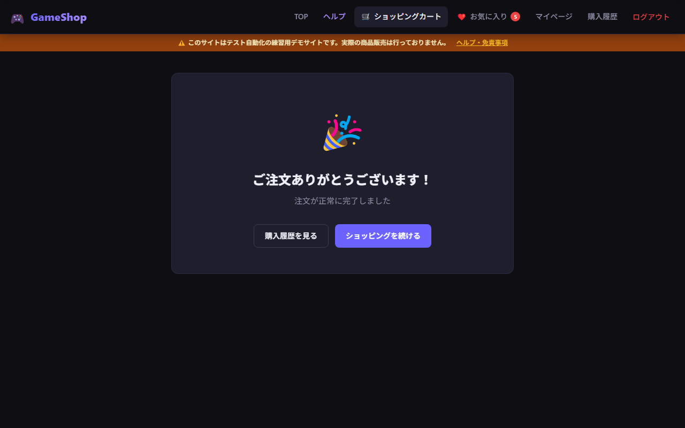

- お祝いアイコンと「ご注文ありがとうございます！」メッセージ
- **注文番号** — `GS-YYYYMMDD-HHmmss-XXXX` 形式でユニークなIDを発行
- 注文日時・注文商品一覧・合計金額・配送先・支払い方法を表示
- 「購入履歴を見る」「ショッピングを続ける」ボタン

---

### 購入履歴

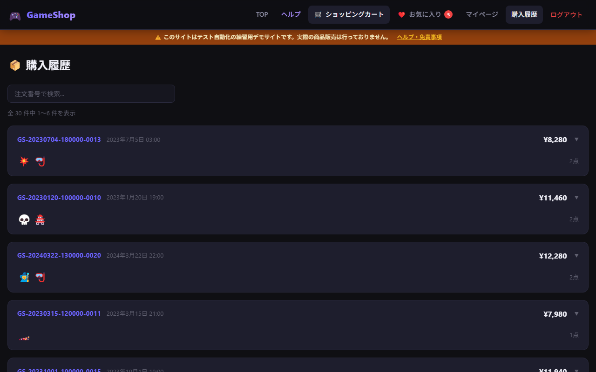

- **注文番号検索** — 番号（またはその一部）を入力してリアルタイム絞り込み
- **アコーディオン表示** — 注文ヘッダー（注文ID・日時・合計）をクリックで詳細を展開
- 絵文字サムネイルのプレビュー（先頭5件、超過分は +X 表示）
- **ページネーション** — 6件ずつ表示、ページ番号ボタンと前後ナビ

---

### 購入履歴（展開表示）

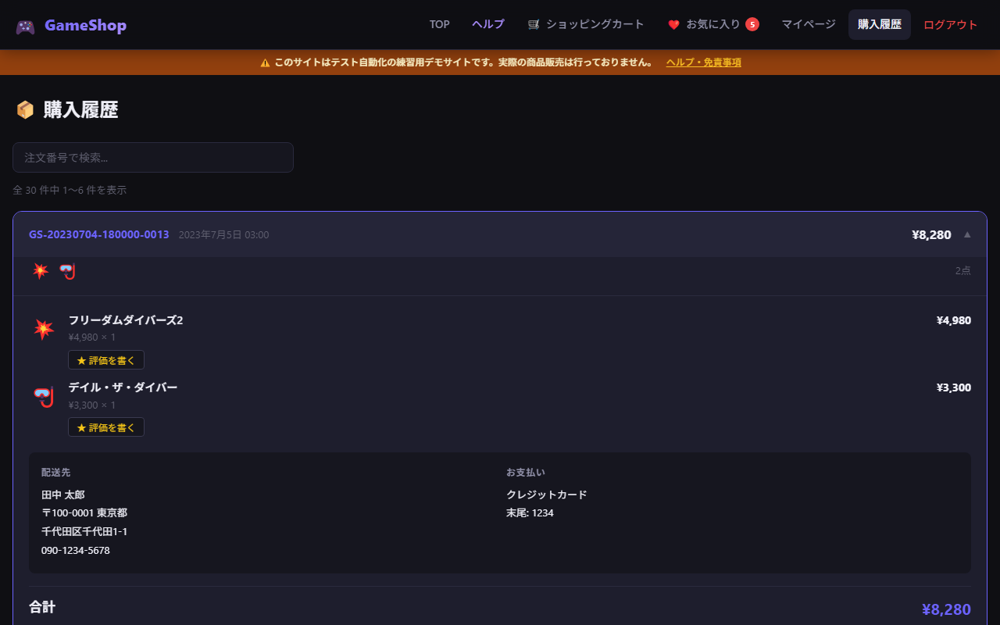

注文をクリックすると詳細が展開されます。

- 商品名・単価 × 数量・小計
- 配送先情報・支払い方法
- **商品評価ボタン** — 購入済み商品ごとに「★ 評価を書く」ボタンが表示され、モーダルで星1〜5評価＋コメントを投稿可能

---

### マイページ

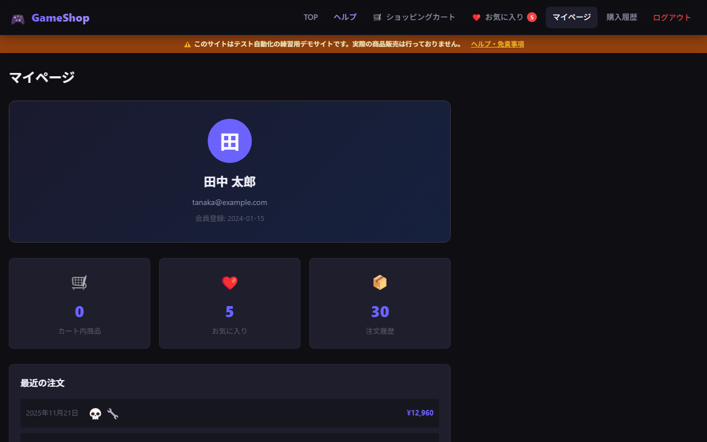

- **プロフィールカード** — アバター（名前の頭文字）・名前・メールアドレス・会員登録日
- **統計カード** — カート内商品数・お気に入り数・注文履歴件数（各画面へのリンク付き）
- **最近の注文** — 直近5件の注文を絵文字プレビュー付きで表示
- **デフォルトカード** — 登録済みクレジットカードを残高・有効期限付きで表示（限度額警告あり）
- **好きなジャンル編集** — タグ表示/チェックボックス編集を切り替え可能
- **ログアウト** — 確認ダイアログ付き

---

### お気に入り

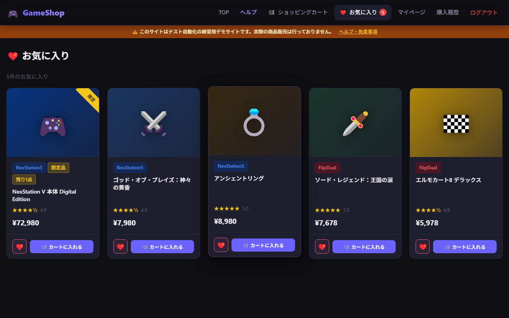

- お気に入り登録した商品を一覧表示
- スケルトンUI（800msローディング演出）
- 「X件のお気に入り」カウント表示
- 商品カードから直接カートに追加可能

---

### ログイン

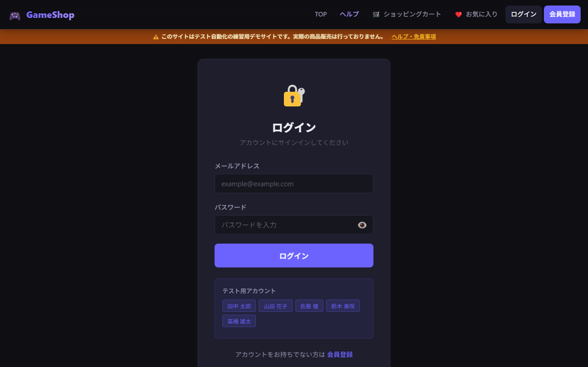

- メールアドレス・パスワード入力
- パスワード表示/非表示切り替え（目アイコン）
- **テスト用アカウント** ボタン — 5アカウントのメールを1クリックで自動入力
- 会員登録ページへのリンク

**テストアカウント一覧:**

| 名前 | メールアドレス | パスワード | 備考 |
|------|-------------|----------|------|
| 田中 太郎 | tanaka@example.com | GamePass#2024 | カード限度額 ¥10,000 |
| 山田 花子 | yamada@example.com | Switch2@Love | カード限度額 ¥50,000 |
| 佐藤 健 | sato@example.com | SoulsLiker99 | カード限度額 ¥50,000 |
| 鈴木 美咲 | suzuki@example.com | Kawaii_Gamer! | — |
| 高橋 雄太 | takahashi@example.com | Pro_Gamer2025 | — |

---

### 会員登録

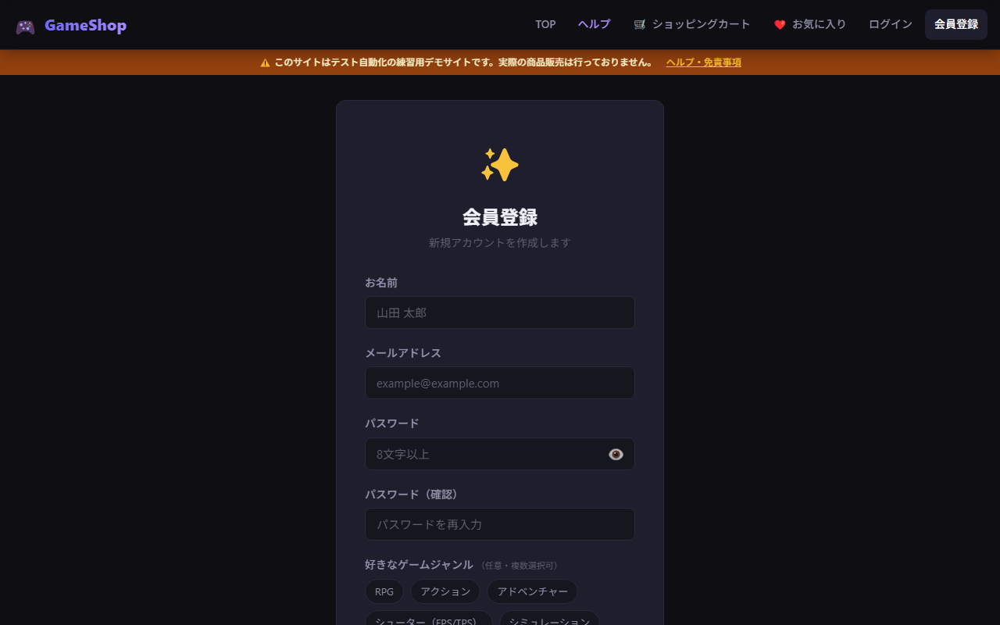

- お名前・メールアドレス・パスワード（8文字以上）・パスワード確認
- **好きなゲームジャンル** — 14ジャンルから複数選択（任意）。登録後のTOPページで「好きなジャンル」ボタンとして活用
- メール重複チェック・パスワード一致バリデーション
- 登録完了後に自動ログインしてTOPページへ遷移

---

### ヘルプ・免責事項

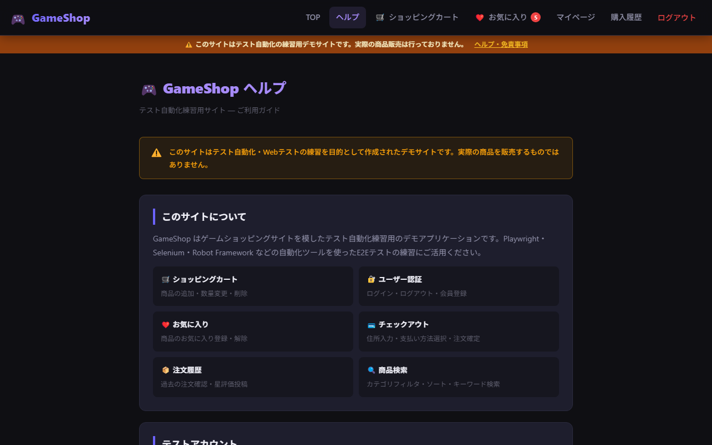

- **このサイトについて** — 6機能の概要グリッド
- **テストアカウント一覧** — 各アカウントの情報と特記事項
- **ご利用ガイド** — 5ステップの使い方説明
- **免責事項** — テストサイトである旨の注意事項

---

## 技術スタック

- **Vue 3** — Composition API (`<script setup>`)
- **Vue Router 4** — `createWebHashHistory` (GitHub Pages 対応)
- **Vite 5** — ビルドツール
- **JavaScript** — TypeScript なし

状態管理はライブラリ不使用（`reactive` ストア + sessionStorage 永続化）。

---

## セットアップ

```bash
# 依存パッケージのインストール
npm install

# 開発サーバー起動 (http://localhost:5173/shopping/)
npm run dev

# プロダクションビルド
npm run build

# ビルド結果のプレビュー
npm run preview
```

---

## デプロイ (GitHub Pages)

`dist/` の内容を `gh-pages` ブランチへプッシュしてデプロイします。

```bash
npm run build

DEPLOY_DIR=/c/Users/sadaaki.emura/AppData/Local/Temp/gh-pages-deploy
rm -rf $DEPLOY_DIR
git clone --branch gh-pages https://github.com/SadaakiEmuraValtes/shopping.git $DEPLOY_DIR
cp -r dist/. $DEPLOY_DIR/
cd $DEPLOY_DIR && git add -A && git commit -m "Deploy" && git push origin gh-pages
```

`vite.config.js` の `base` は `/shopping/` に設定済みです。

---

## プロジェクト構成

```
src/
├── App.vue               # ルートコンポーネント（ヘッダー・フッター含む）
├── main.js               # エントリーポイント
├── router/
│   └── index.js          # ルーティング定義
├── store/
│   └── index.js          # グローバルストア（reactive + sessionStorage）
├── components/
│   ├── AppHeader.vue     # ナビゲーションヘッダー
│   └── ProductCard.vue   # 商品カードコンポーネント
├── views/
│   ├── HomeView.vue          # TOPページ（商品一覧・広告）
│   ├── ProductDetailView.vue # 商品詳細
│   ├── CartView.vue          # カート
│   ├── CheckoutView.vue      # チェックアウト
│   ├── OrderCompleteView.vue # 注文完了
│   ├── PurchaseHistoryView.vue # 購入履歴
│   ├── LoginView.vue         # ログイン
│   ├── RegisterView.vue      # 会員登録
│   ├── MyPageView.vue        # マイページ
│   ├── FavoritesView.vue     # お気に入り
│   ├── ReviewsView.vue       # レビュー一覧（iframe）
│   └── HelpView.vue          # ヘルプ
└── data/
    ├── products.js       # 商品マスタデータ（54商品）
    ├── users.js          # デモユーザーデータ（5アカウント）
    ├── genres.js         # ゲームジャンル定数（14ジャンル）
    └── reviews.js        # レビューデータ
```

---

## 注文番号フォーマット

注文完了時に以下の形式でユニークな注文番号が発行されます。

```
GS-20260309-153042-4829
 ^   ^        ^      ^
 |   日付      時刻   4桁乱数
 プレフィックス
```

購入履歴画面でこの番号（またはその一部）を入力して注文を検索できます。

---

## ライセンス

個人学習・テスト自動化練習用デモサイト。実際の商品販売は行っておりません。
